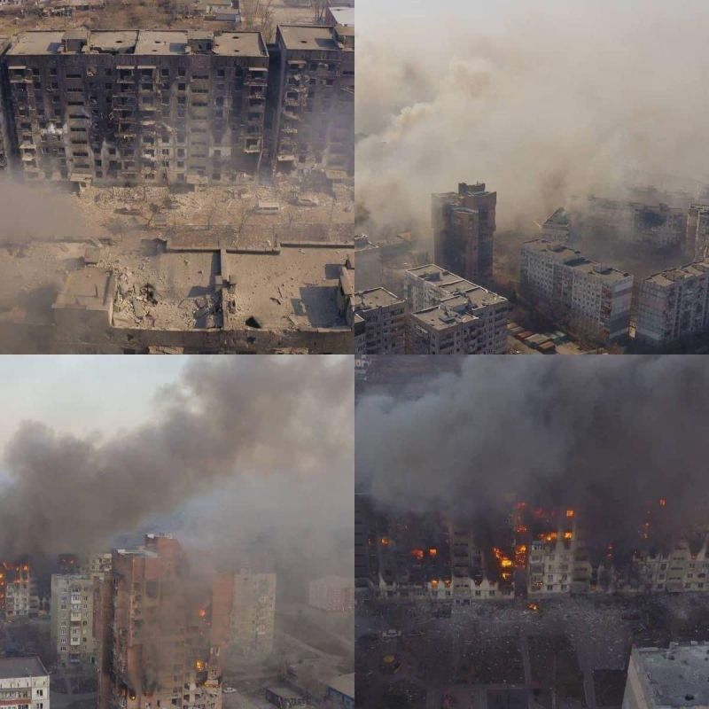

{}
The Russians have started their bloody war in Ukraine, deliberately killing thousands of Ukrainian civilians.

<iframe width="560" height="315" src="https://www.youtube.com/embed/cccGKGmG1h0?si=hBaAO4HyqDg356lj" title="YouTube video player" frameborder="0" allow="accelerometer; autoplay; clipboard-write; encrypted-media; gyroscope; picture-in-picture; web-share" allowfullscreen></iframe>

"This is Mariupol, a city in Ukraine where 400 000 people lived, thousands of them died, babies included. Try to remember this picture every time when making business with Russians.

And do not say that "it is just Putin, not Russians". Russians do not care, they silently or even openly support it. It is not the first city they destroyed. Grozny and Aleppo had the same fate. And the same Russians who are now saying "for what?" did not care back then when Chechens and Syrians were dying. They won't care and do not want to see it. They were ok with it as long as their life was ok. Even now they are banning any info that we are sending to them, even on a personal level when nothing is censored by the Russian government, even our relatives from Russia do not want to listen to us.

So the only way to make them see this and hundreds of other pictures is to get them out of their bubble by making their fridge empty. They won't die from it, do not worry. But they will start thinking about what could be wrong. And the sooner it happens, the more people will stay alive, in Russia too, as 17 000 young Russian men already died, and they are searching for more conscripts to throw into the slaughter. It is better for everyone if they stay home."
(Volodymyr Kukharenko)

{}

This Documentation Portal provides information on static site generators and other tools for technical writers. This site is built using the Docsy theme and Hugo static site generator.