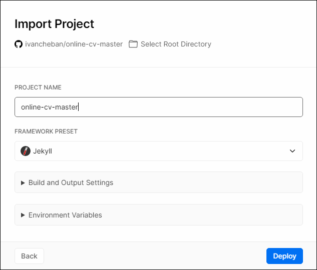

{}
The goal is to help you choose a documentation tool that uses docs-as-code, Markdown, and doesn't require much time to deploy.
{}

## Introduction

While there are many documentation tools for technical writers, sometimes even experienced tech writers ask themselves: which tool should I use for my project? Your project may be API Reference or end-user documentation, online help for your product, or any other domain. In this article, I focus on the customer-facing docs, not the internal documentation that you write in wiki systems like Confluence or CMS like SharePoint Online. You can have authentication or password protection for your customer-facing docs site, of course.

Ok, so your manager or your test task requires you to come up with the best documentation solution for their product/API/you name it. They may even offer you some hints like Word, SharePoint, or even some unknown commercial tools for building docs sites. The first question I would ask, is whether they've been using this tool before and satisfied with it. If both answers are yes, maybe it's not worth convincing them that your tool would do a better job. However, you can still create a demo site or show them available projects built with Docusaurus or MkDocs Material static site generators.

## Docusaurus and MkDocs Material

Have you heard about [Docusaurus](https://docusaurus.io/) and [MkDocs Material](https://squidfunk.github.io/mkdocs-material/)? These are static site generators (SSGs) that build a static documentation site. These SSGs use the [docs-as-code](../docs-as-code) approach, Markdown, and git. They're designed specifically for technical writers or developers who want to stand up a nice-looking docs site effortlessly and quickly. I wrote a [comprehensive guide](../docs-as-cod/#docusaurus-static-site-generator) how to start working with Docusaurus a couple of years ago. As this tool is developed, some things could have changed. That's why I'm going to go step by step again to deploy a Docusaurus documentation site.

[MkDocs Material](https://squidfunk.github.io/mkdocs-material/) has long been on my list of the best SSGs for documentation sites. Material theme of MkDocs is designed for documentation writers. It has many features, you'd better consult their documentation.

## Docusaurus

{}
The goal is to build and deploy a test Docusaurus site. You can then reproduce the steps to build your own docs site and deploy it to public GitHub Pages.
{}

### Prerequisites

You need to have the following items installed on your computer.

#### Node.js

You can check if it's already installed by typing `node -v` in the terminal or Command Prompt. You need v.18 or later.


If you have an older version, remove it using Windows **Add or remove programs**. Then install the newest version from [here](https://nodejs.org/en/download/current).

#### Install Docusaurus package

Use Node.js command to install Docusaurus on your computer:

1. Run `npm init docusaurus`.

1. Type `y` when prompted and press Enter.

    

1. Type the name of your site (project) when prompted and press Enter.

    

1. Select the recommended `classic` template by pressing Enter.

    

1. Select JavaScript by pressing Enter.

    

1. Type `cd test-docusaurus-docs` to go to the folder with installed Docusaurus.

1. Type `npm start` to start a live server for opening the docs site in your browser on local host.

    

Your site opens in the browser with this address: [http://localhost:3000/](http://localhost:3000/)


### Deploy Docusaurus to GitHub Pages

Now that you've built your site locally, you can start editing its content in Markdown and customize the site theme: CSS, logo, name, sidebar menu, etc. I don't intend to show all these steps as I've described them [here](../docs-as-code/#adjust-the-appearance-of-the-site). Instead I will provide instructions on deploying your site to GitHub Pages, so it's available on the internet.

1. Use VS Code to open your Docusaurus project: **File > Open Folder...** and select your project name that you typed when installing Docusaurus. In my case, it's `test-docusaurus-docs`.

1. Select **Source Control** tab in VS Code left side panel.

    

1. Select **Initialize Repository**.

1. Select **Commit**.

    

1. Enter the commit message. For example: first commit. Press Enter.

1. Select **Publish Branch**.

1. Select **Publish to GitHub public repository**.

    

1. Select **Open on GitHub** to open the project in the web version of GitHub.

    

To deploy your site on GitHub Pages:

1. In VS Code, go to Explorer tab and select the `docusaurus.config.js` file that stores configuration of your Docusaurus site. In my case, the path is `C:\Users\ivanc\test-docusaurus-docs\docusaurus.config.js`.

1. Change the values for the following parameters:

    * `organizationName` - In my case, it's `ivancheban`, my GitHub account.
    * `projectName` - In my case, it's `test-docusaurus-docs`, your Docusaurus project name you selected and published to GitHub.
    * `url` - In my case, it's `https://ivancheban.github.io`.
    * `baseUrl` - In my case, it's `/test-docusaurus-docs/`.

        

1. In the root folder of your Docusaurus project, create the `deploy.yml` file with this path: `.github/workflows/deploy.yml`. It means that first you create the `.github` folder, then `workflows` folder inside it, and only then the `deploy.yml` file. Paste the following code inside the `deploy.yml` file.

    ```yml
    name: Deploy to GitHub Pages

    on:
    push:
        branches:
        - main
        # Review gh actions docs if you want to further define triggers, paths, etc
        # https://docs.github.com/en/actions/using-workflows/workflow-syntax-for-github-actions#on

    jobs:
    build:
        name: Build Docusaurus
        runs-on: ubuntu-latest
        steps:
        - uses: actions/checkout@v4
            with:
            fetch-depth: 0
        - uses: actions/setup-node@v4
            with:
            node-version: 18
            cache: npm

        - name: Install dependencies
            run: npm ci
        - name: Build website
            run: npm run build

        - name: Upload Build Artifact
            uses: actions/upload-pages-artifact@v3
            with:
            path: build

    deploy:
        name: Deploy to GitHub Pages
        needs: build

        # Grant GITHUB_TOKEN the permissions required to make a Pages deployment
        permissions:
        pages: write # to deploy to Pages
        id-token: write # to verify the deployment originates from an appropriate source

        # Deploy to the github-pages environment
        environment:
        name: github-pages
        url: ${{ steps.deployment.outputs.page_url }}

        runs-on: ubuntu-latest
        steps:
        - name: Deploy to GitHub Pages
            id: deployment
            uses: actions/deploy-pages@v4
    ```

1. Commit and push your changes:

    * `Ctrl + Shift + P`.
    * Select `Git: Commit All`.
    * Add the commit message.
    * `Ctrl + Shift + P`.
    * Select `Git: Push`.

1. Create a `gh-pages` branch in your Docusaurus project. Although you commit and push to the `main` branch, the `gh-pages` branch will be used for deployment of your site on GitHub Pages.

1. Go to **Settings** in GitHub page of your project.

    

1. Select **Pages** and select the `gh-pages` branch. Save the changes.

    

1. Change anything in your local files, commit and push changes. The commit to the main branch starts the site deployment. Wait while the pipeline finishes building and deploying your site. Check the built site. In my case, it's: [https://ivancheban.github.io/test-docusaurus-docs/](https://ivancheban.github.io/test-docusaurus-docs/).

## MkDocs Material

{}
The goal is to build and deploy a test MkDocs Material site. You can then reproduce the steps to build your own docs site and deploy it to public GitHub Pages.
{}

### Prerequisites

You need to have Python with pip for MkDocs. Then you can install MkDocs and the MkDocs Material packages using pip.

1. **Ensure Python is installed**: You can check if Python is installed on your system by opening a command prompt and typing `python --version`. If Python is installed, you will see something like `Python 3.11.3`. If you don't have Python installed, install it from their [official website](https://www.python.org/downloads/windows/).

1. **Ensure pip is installed**: You can check if pip is installed by typing `pip --version` in the command prompt. If pip is installed, it will display the version.

1. **Install MkDocs**: Type `pip install mkdocs` in the command prompt. Make sure MkDocs is installed by typing `mkdocs --version`.

1. **Install MkDocs Material**: Type `pip install mkdocs-material` in the command prompt. To check if MkDocs Material is installed, type `mkdocs serve --help`.  This command should list material as an option under the `--theme`. If material is listed, it means that Material for MkDocs is installed correctly.

    

For more information, see [MkDocs Installation](https://www.mkdocs.org/user-guide/installation/) and MkDocs [Material Installation](https://squidfunk.github.io/mkdocs-material/getting-started/#with-pip).

### Install the MkDocs site

You can continue creating a brand new MkDocs Material site using [these instructions](https://squidfunk.github.io/mkdocs-material/creating-your-site/). Or, you can fork my repo with the ready configuration:

1. Fork or download the zipped project from here: [https://github.com/ivancheban/my-project](https://github.com/ivancheban/my-project).

1. Open the `mkdocs.yml` file to edit the configuration of your site.

    ```yml
    site_name: Docs site
    site_url: https://ivancheban.github.io/my-project/
    nav:
        - Introduction: 'index.md'
        - User Guide:
            - 'Test': 'test-folder/test.md'
            - 'Test 1': 'test-folder/test1.md'
            - 'Test 2': 'test-folder/test2.md'
        - About:
            - 'About this site': 'about.md'
    theme:
    features:
        - navigation.footer
    name: material
    custom_dir: overrides
    logo: img/logo.svg
    favicon: img/favicon.ico
    palette: 
        scheme: default
        accent: light blue
    
    extra_css:
    - stylesheets/extra.css

    plugins:
    - search
    - mike

    extra:
    version:
        provider: mike
    social:
        - icon: fontawesome/brands/github
        link: https://github.com/ivancheban
        - icon: fontawesome/brands/linkedin
        link: https://linkedin.com/in/ivan-cheban-a24b576
    generator: false

    markdown_extensions:
    - pymdownx.superfences:
        custom_fences:
            - name: mermaid
            class: mermaid
            format: !!python/name:pymdownx.superfences.fence_code_format
    - admonition
    - pymdownx.details
    - pymdownx.tabbed:
        alternate_style: true
    copyright: Copyright &copy; 2023 Ivan Cheban
    ```

1. To run the site on your local host, type: `mkdocs serve`. This starts the site in your browser with this address: [http://127.0.0.1:8000/my-project/](http://127.0.0.1:8000/my-project/).

    

### Deploy MkDocs Material to GitHub Pages

Now that you've checked that your MkDocs Material site works locally, it's time to deploy it on GitHub as a public site.

1. Use the [steps 1–8 from deploying a Docusaurus site to GitHub](#deploy-docusaurus-to-github-pages) for committing and pushing your MkDocs project to a GitHub repository.

1. Create a `gh-pages` branch in your repository.

1. In the web interface of your repository, Go to **Settings > Pages** and selected `gh-pages` as a branch to deploy your site from. Save the changes.

1. At the root of your MkDocs project, create a new GitHub Actions workflow file: `.github/workflows/ci.yml`, and copy and paste the following contents:

    ```yml
    name: ci 
    on:
    push:
        branches:
        - master 
        - main
    permissions:
    contents: write
    jobs:
    deploy:
        runs-on: ubuntu-latest
        steps:
        - uses: actions/checkout@v4
        - name: Configure Git Credentials
            run: |
            git config user.name github-actions[bot]
            git config user.email 41898282+github-actions[bot]@users.noreply.github.com
        - uses: actions/setup-python@v5
            with:
            python-version: 3.x
        - run: echo "cache_id=$(date --utc '+%V')" >> $GITHUB_ENV 
        - uses: actions/cache@v4
            with:
            key: mkdocs-material-${{ env.cache_id }}
            path: .cache
            restore-keys: |
                mkdocs-material-
        - run: pip install mkdocs-material 
        - run: mkdocs gh-deploy --force
    ```

1. Commit and push your changes.
